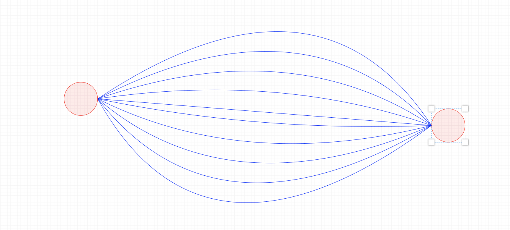
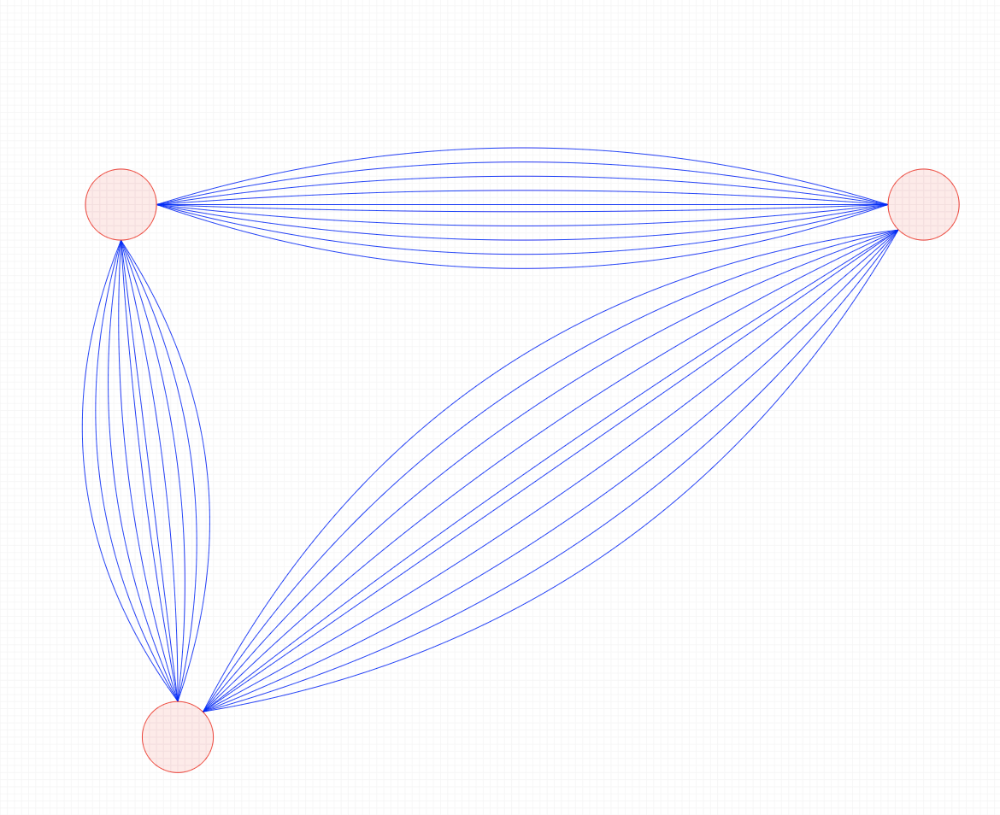
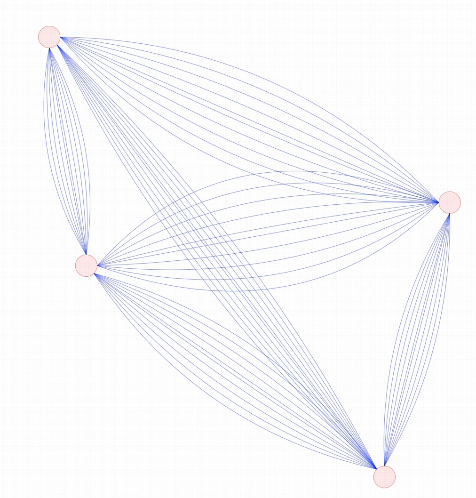
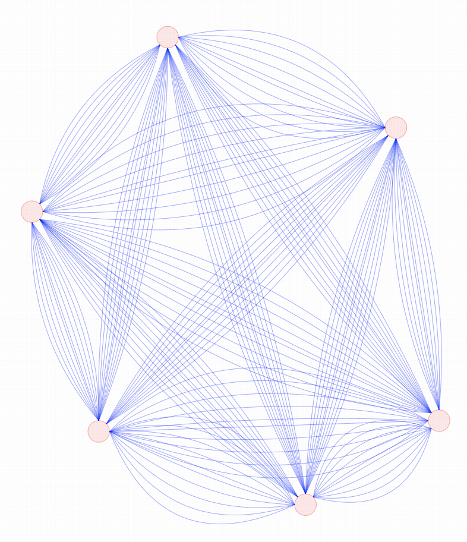
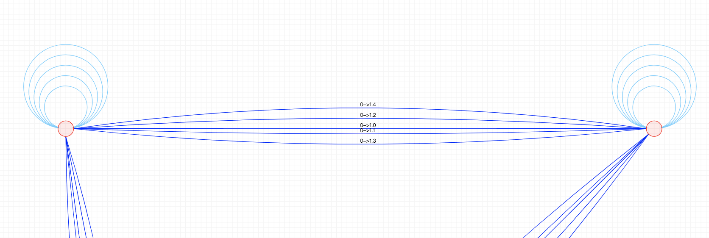
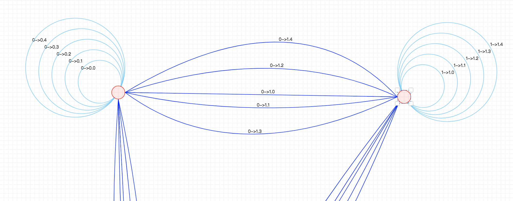
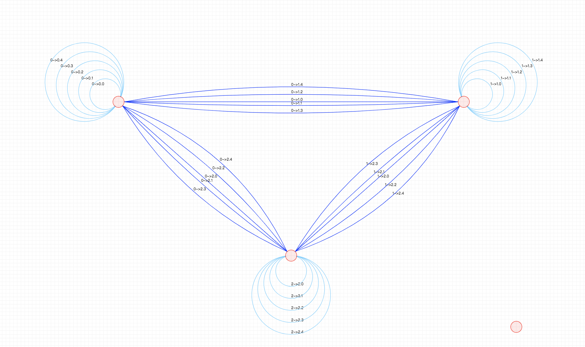
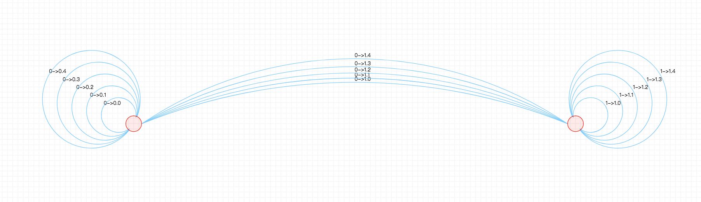
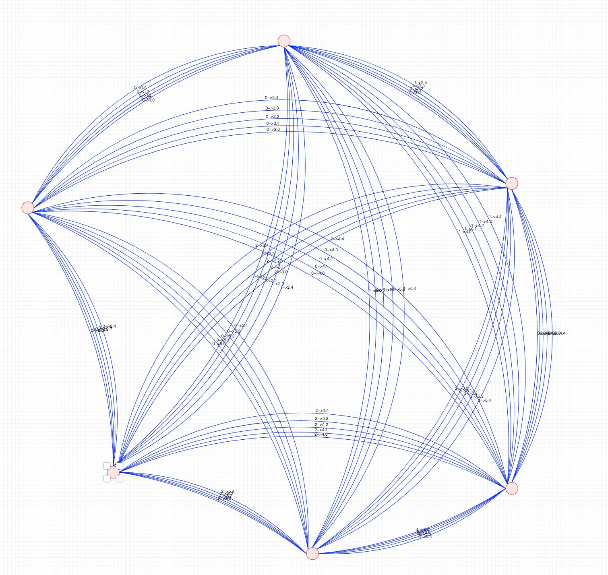
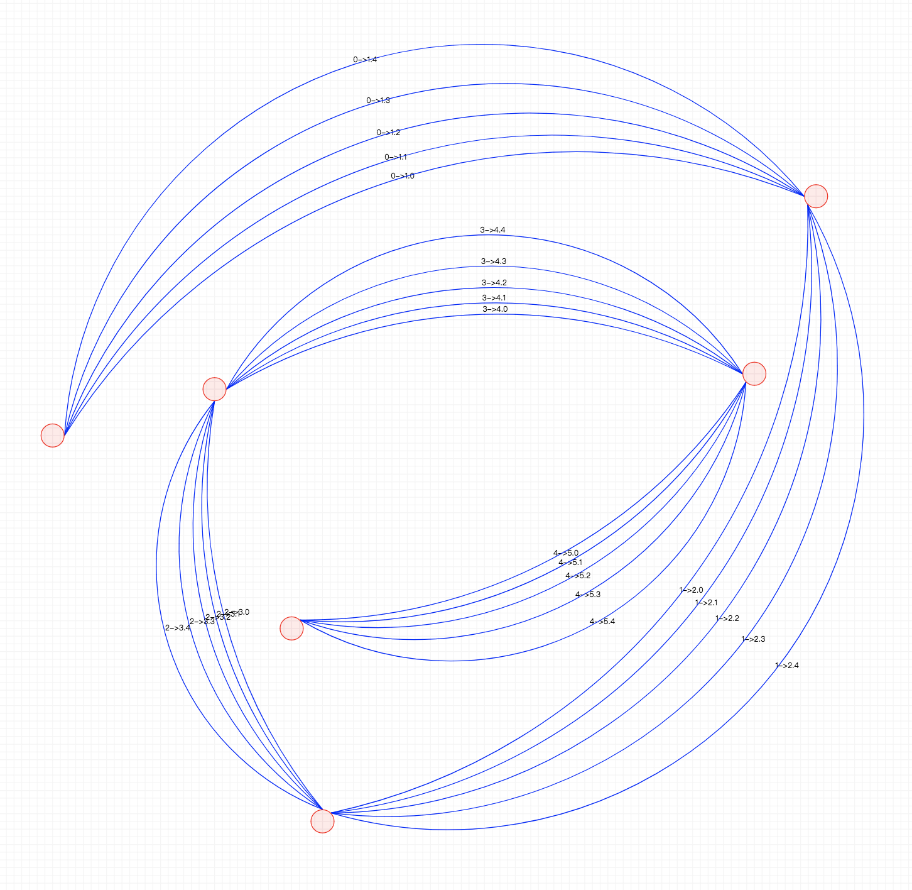

## AntV G6 关于多边绘制的解决方案

AntV的G6库致力于处理关系图，并且有很好的绑定与使用的借口。但是在实际的需求中，我们需要处理两个节点间的多度关系，这样就要求能有较好的边分布，或者对于整个图有更加好的节点分布计划。

### 关于边的分布

#### 二维贝塞尔

取最简单的情况，两个点，第一个解决方案是使用二维贝塞尔曲线，并且曲线的分散点在两个点的垂直平分线上：

这样可以保证是上下离散的点，并且较大限度利用两个点之间的区域来绘制边的。

但是在多点多边的情况下，容易出现起点线段的交集。

所以目前看来，对于多点的复杂情况，应该在分布点的时候合理根据出入度分布点。

而且需要解决因为斜率而导致的边间空隙过大/过小。

下面示例为六个点，共100条边。

关于文字描述，在贝塞尔曲线正中心可以加上文字的描述，效果如图：

#### 自己到自己的边

考虑多度图中的关系还有自己到自己的边，所以我们采用圆弧线来表示自己到自己的关系。

确定了中心后，我们要获取点的半径，角度以k为变量方便后期调整。

考虑最简单情况，沿着垂直向上的半径作圆

接着考虑复杂情况，我们把直径旋转k度，并且添加上文字

三个点的情况

#### 弧线链接

考虑这样一个场景，当一个点到其他两个点到边数较多，而到其余点无边或者边数较少时，我们可以使用弧线来对三个点进行连接。

同样，考虑两个点的情况，圆心在两个点的垂直平分线上，这段圆弧经过两个点，当存在多条圆弧的时候，我们采用取不同的圆心来计算圆弧的形状。

下面是多边的情况：

上图是六个节点，一共一百条边

一种比较符合设想场景的使用：

### 进一步的思考 (To Be Done)

#### 功能性构想：可收缩边

我们可以在边上添加组件，通过收缩过多的边关系来简化视图。

#### 关于点的分布

多度图最主要的一个优化就是需要生成合理的点分布，所以在点分布的思路如下

- 根据图的出度以及入度的绝对值相加，将两个点间所有点算作这条边的权，一个节点的权为边权的和，之后根据权的大小，生成最小生成树。
- 根据节点的权，我们可以将大点分出来，独立分布，而小点依次分布在以大权点为圆心的圆上。
- 若是按照树来构成，那么计算出来的树结构则应该从画布沿对角线分布

